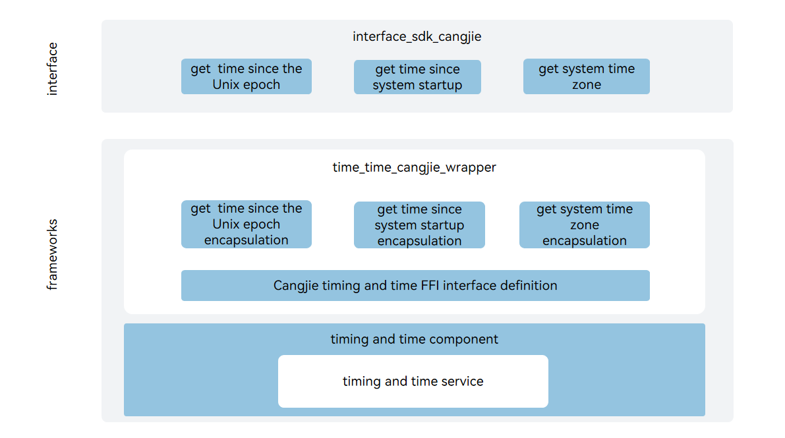

# Time Zone Cangjie Wrapper

## Introduction

The Time Zone Cangjie Wrapper provides time zone-related capabilities for developers using the Cangjie language for application development on OpenHarmony. The Time Zone Cangjie Wrapper provides the ability to obtain the system time zone and only supports standard devices.

## System Architecture

**Figure 1** Time Zone Cangjie Interface Architecture



As shown in the architecture diagram:

Interface Layer:

- Time Zone Function Interface: Provides system time and system time zone functions. Developers can obtain the system time and time zone.

Framework Layer:

- -Time zone function encapsulation: This encapsulation layer is a Cangjie encapsulation implementation for obtaining system time and system time zone capabilities.

Dependency Component Introduction in Architecture Diagram

- time_service: Responsible for providing basic time zone functions.
- cangjie_ark_interop: Responsible for providing Cangjie annotation class definitions for API annotation, and providing BusinessException exception class definitions thrown to users.
- hiviewdfx_cangjie_wrapper: Responsible for providing log interfaces for printing logs at critical paths.

## Directory

```
base/time/time_cangjie_wrapper
├── figures                     # Architecture diagrams in README
├── ohos
│   └── system_date_time        # Cangjie time zone interface implementation
└── test
    └── system_date_time        # Cangjie time zone interface test code
```

## Usage Instructions

Provides the following time zone functions:

- Get time elapsed from Unix epoch to current system time
- Get time elapsed since system boot
- Get system time zone

For time zone-related APIs, please refer to [Time Zone API Reference](https://gitcode.com/openharmony-sig/arkcompiler_cangjie_ark_interop/blob/master/doc/API_Reference/source_en/apis/BasicServicesKit/cj-apis-system_date_time.md).
For relevant guidelines, please refer to the [Time Zone Guide](https://gitcode.com/openharmony-sig/arkcompiler_cangjie_ark_interop/blob/master/doc/Dev_Guide/source_en/system_date_time/cj-system_data_time.md).

## Constraints

Compared to APIs provided by ArkTS, the following functions are not currently supported:

- Setting system time
- Setting system time zone
- Creating/starting/stopping/destroying timers

## Contribution

Developers are welcome to contribute code, documentation, etc. For specific contribution processes and methods, please refer to [Contribution](https://gitcode.com/openharmony/docs/blob/master/en/contribute/how-to-contribute.md).

## Related Repositories

[time_service](https://gitcode.com/openharmony/time_time_service/blob/master/README.md)

[cangjie_ark_interop](https://gitcode.com/openharmony-sig/arkcompiler_cangjie_ark_interop/blob/master/README.md)

[hiviewdfx_cangjie_wrapper](https://gitcode.com/openharmony-sig/hiviewdfx_hiviewdfx_cangjie_wrapper/blob/master/README.md)
