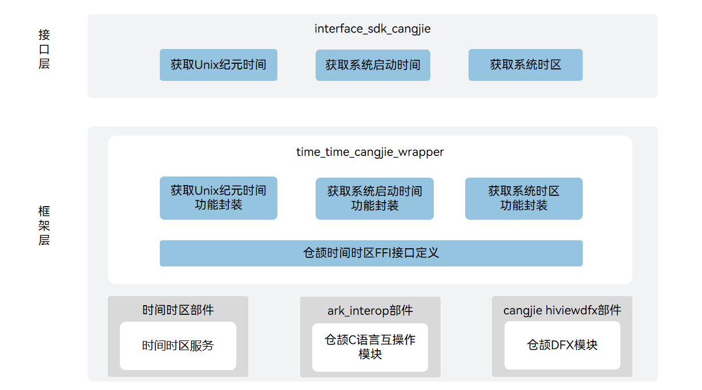

# 时间时区仓颉封装

## 简介

时间时区仓颉封装是 OpenHarmony 上面向开发者提供使用仓颉语言进行应用开发时的时间时区相关能力。时间时区子系统为 OpenHarmony 系统提供了管理系统时间时区和定时的能力，包括：

- **管理时间时区**
  统一管理系统时间时区，包括设置/获取系统时间、日期、时区，同时提供获取系统启动时间。
- **定时能力**
  提供系统定时器能力。包括定时器创建、启动、停止和销毁。定时器类型提供三种：系统启动时间计时类定时器、系统当前时间计时类定时器、唤醒类定时器。

当前时间时区仓颉封装支持standard设备，只提供获取时间时区的能力。

## 系统架构

**图 1**  时间时区仓颉架构图



如架构图所示：

接口层

- 获取Unix纪元时间：面向开发者提供获取自Unix纪元以来经过时间的能力。
- 获取系统启动时间：面向开发者提供获取自系统启动以来经过时间的能力。
- 获取系统时区：面向开发者提供获取当前系统时区的能力。

框架层

- 获取Unix纪元时间功能封装：基于底层时间时区部件提供的获取Unix纪元时间的能力，实现仓颉获取Unix纪元时间的功能。
- 获取系统启动时间功能封装：基于底层时间时区部件提供的获取系统启动时间的能力，实现仓颉获取系统启动时间的功能。
- 获取系统时区功能封装：基于底层时间时区部件提供的获取系统时区的能力，实现仓颉获取系统时区功能。
- 仓颉时间时区FFI接口定义：负责定义被仓颉语言调用的C语言互操作接口，用于实现仓颉时间时区能力。

架构图中的依赖部件引入说明：

- time_service：负责提供时间时区基础功能，封装C语言接口提供给仓颉进行互操作。
- cangjie_ark_interop：负责提供仓颉注解类定义，用于对API进行标注，以及提供抛向用户的BusinessException异常类定义。
- hiviewdfx_cangjie_wrapper：负责提供日志接口，用于在关键路径处打印日志。

## 目录

```
base/time/time_cangjie_wrapper
├── figures                     # 存放README中的架构图
├── ohos
│   └── system_date_time        # 仓颉时间时区接口实现
└── test
    └── system_date_time        # 仓颉时间时区接口测试代码
```

## 使用说明

提供以下时间时区功能：

- 获取自Unix纪元以来到当前系统时间所经过的时间
- 获取自系统启动以来经过的时间
- 获取系统时区

时间时区相关API请参见[时间时区API参考](https://gitcode.com/openharmony-sig/arkcompiler_cangjie_ark_interop/blob/master/doc/API_Reference/source_zh_cn/apis/BasicServicesKit/cj-apis-system_date_time.md)。

## 约束

与 ArkTS 提供的API能力相比，暂不支持以下功能：

- 设置系统时间
- 设置系统时区
- 创建/开启/停止/销毁 定时器

## 参与贡献

欢迎广大开发者贡献代码、文档等，具体的贡献流程和方式请参见[参与贡献](https://gitcode.com/openharmony/docs/blob/master/zh-cn/contribute/%E5%8F%82%E4%B8%8E%E8%B4%A1%E7%8C%AE.md)。

## 相关仓

[time_service](https://gitcode.com/openharmony/time_time_service/blob/master/README_zh.md)

[cangjie_ark_interop](https://gitcode.com/openharmony-sig/arkcompiler_cangjie_ark_interop/blob/master/README_zh.md)

[hiviewdfx_cangjie_wrapper](https://gitcode.com/openharmony-sig/hiviewdfx_hiviewdfx_cangjie_wrapper/blob/master/README_zh.md)
